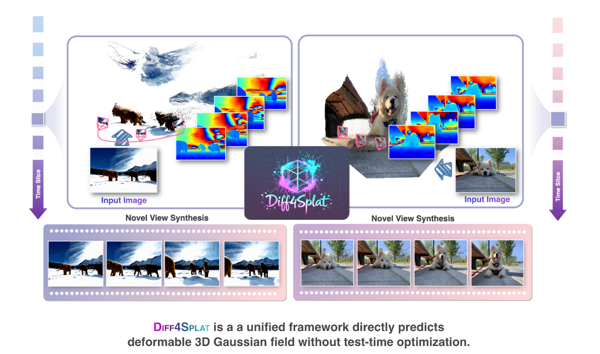

# Diff4Splat: Controllable 4D Scene Generation with Latent Dynamic Reconstruction Models

<h4 align="center">

[Panwang Pan<sup>†</sup>](https://paulpanwang.github.io), [Chenguo Lin<sup>†</sup>](https://chenguolin.github.io), [Jingjing Zhao](), [Chenxin Li](), [Yuchen Lin](https://wgsxm.github.io), [Haopeng Li](), [Honglei Yan](https://openreview.net/profile?id=~Honglei_Yan1), [Kairun Wen](), [Yunlong Lin](), [Yixuan Yuan](), [Yadong Mu](http://www.muyadong.com)

[](https://arxiv.org/abs/2511.00503)
[](https://paulpanwang.github.io/Diff4Splat/)
[](https://paulpanwang.github.io/Diff4Splat/)
[](https://paulpanwang.github.io/Diff4Splat/)
[](https://paulpanwang.github.io/Diff4Splat/)

<p align="center">
    
</p>

</h4>

This repository contains the official implementation of the paper: [Diff4Splat: Controllable 4D Scene Generation with Latent Dynamic Reconstruction Models](https://arxiv.org/abs/2511.00503). 
Diff4Splat is a feed-forward method that synthesizes controllable and explicit 4D scenes from a single image. Our approach unifies the generative priors of video diffusion models with geometry and motion constraints learned from large-scale 4D datasets.

Given a single input image, a camera trajectory, and an optional text prompt, Diff4Splat directly predicts a deformable 3D Gaussian field that encodes appearance, geometry, and motion, all in a single forward pass, without test-time optimization or post-hoc refinement.

Here is our [Project Page](https://paulpanwang.github.io/Diff4Splat/).

Feel free to contact us or open an issue if you have any questions or suggestions.

## 📢 News
- **2025-11-01**: Diff4Splat is released on arXiv.
- **2025-10-15**: Initial codebase structure established.
- **2025-10-01**: Project development started.

## 📋 TODO
- [ ] Release inference scripts.
- [ ] Release training code and data preprocessing scripts.
- [ ] Release pretrained checkpoints.
- [ ] Provide a HuggingFace🤗 demo.
- [ ] Release preprocessed dataset.

## 🔧 Installation
*Coming soon - Installation instructions will be provided once the codebase is ready for release.*

## 💡 Quick Start
*Coming soon - Quick start examples will be provided once the inference scripts are released.*

## 💻 System Requirements
A CUDA-enabled GPU with at least 12GB VRAM is recommended for optimal performance. The model can be adapted to run on GPUs with less memory by adjusting the resolution and batch size parameters.

## 📊 Dataset
*Dataset information and preprocessing scripts will be released along with the training code.*

## 🦾 Training
*Training scripts and configurations will be released in the future.*

## 🎯 Method Overview

Diff4Splat introduces a novel framework for controllable 4D scene generation:

### Core Components:
1. **Video Latent Transformer**: Augments video diffusion models to jointly capture spatio-temporal dependencies
2. **Deformable 3D Gaussian Field**: Encodes appearance, geometry, and motion in a unified representation
3. **Single Forward Pass**: Generates high-quality 4D scenes in approximately 30 seconds

### Key Features:
- **Controllable Generation**: Supports camera trajectory and optional text prompts
- **Explicit Representation**: Produces deformable 3D Gaussian primitives
- **Efficient Inference**: No test-time optimization or post-hoc refinement required
- **Multi-task Capability**: Supports video generation, novel view synthesis, and geometry extraction

## 📈 Results & Evaluation

Diff4Splat demonstrates state-of-the-art performance across multiple tasks:

### Video Generation
- Generates temporally consistent video sequences from single images
- Supports controllable camera trajectories

### Novel View Synthesis
- Produces high-quality novel views from arbitrary camera positions
- Maintains geometric consistency across viewpoints

### Geometry Extraction
- Extracts accurate 3D geometry from generated scenes
- Enables downstream applications like mesh reconstruction

## 🚀 Roadmap

### Phase 1: Codebase Release (Current)
- [x] Repository setup and documentation
- [ ] Inference code release
- [ ] Pretrained model weights

### Phase 2: Full Implementation
- [ ] Training code release
- [ ] Dataset preprocessing scripts
- [ ] Comprehensive evaluation benchmarks

### Phase 3: Extended Features
- [ ] Real-time inference optimization
- [ ] Multi-modal conditioning support
- [ ] Interactive demo applications

## 📚 Citation

If you find our work helpful, please consider citing:

```bibtex
@article{pan2025diff4splat,
  title={Diff4Splat: Controllable 4D Scene Generation with Latent Dynamic Reconstruction Models},
  author={Pan, Panwang and Lin, Chenguo and Zhao, Jingjing and Li, Chenxin and Lin, Yuchen and Li, Haopeng and Yan, Honglei and Wen, Kairun and Lin, Yunlong and Yuan, Yixuan and others},
  journal={arXiv preprint arXiv:2511.00503},
  year={2025}
}
```

## 📄 License

This project is licensed under the MIT License - see the [LICENSE](LICENSE) file for details.

## 😊 Acknowledgement

We would like to thank the authors of [PartCrafter](https://github.com/wgsxm/PartCrafter), [DiffSplat](https://chenguolin.github.io/projects/DiffSplat/), and other related works for their inspiring research and open-source contributions that helped shape this project.

## 🔗 References

1. [MoVieS: Motion-Aware 4D Dynamic View Synthesis in One Second](https://github.com/chenguolin/MoVieS)
2. [DiffSplat: Single-View 3D Reconstruction via Differentiable Splatting](https://chenguolin.github.io/projects/DiffSplat/)


---

*Note: This README is currently a placeholder. The actual implementation, inference scripts, and training code will be released according to the roadmap above.*