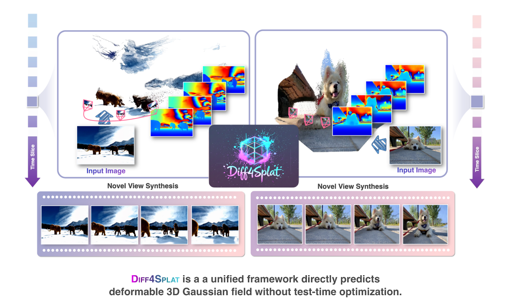

# [CVPR 2026] 🌀Diff4Splat

⚠️ **Code is currently being uploaded** - Please check back later for the complete repository.

<h2 align="center"> <a href="https://paulpanwang.github.io/Diff4Splat">Diff4Splat: Controllable 4D Scene Generation with <br> Latent Dynamic Reconstruction Models</a></h2>

<h4 align="center">

[Panwang Pan<sup>†</sup>](https://paulpanwang.github.io), [Chenguo Lin<sup>†</sup>](https://chenguolin.github.io), [Jingjing Zhao](), [Chenxin Li](), [Yuchen Lin](https://wgsxm.github.io), [Haopeng Li](), [Honglei Yan](https://openreview.net/profile?id=~Honglei_Yan1), [Kairun Wen](), [Yunlong Lin](), [Yixuan Yuan](), [Yadong Mu](http://www.muyadong.com)

[](https://arxiv.org/abs/2511.00503)
[](https://paulpanwang.github.io/Diff4Splat/)
[](https://paulpanwang.github.io/Diff4Splat/)
[](https://huggingface.co/paulpanwang/Diff4Splat)
[](https://huggingface.co/paulpanwang/Diff4Splat)

<p align="center">
    
</p>

</h4>

This repository contains the official implementation of the paper: [Diff4Splat: Controllable 4D Scene Generation with Latent Dynamic Reconstruction Models](https://arxiv.org/abs/2511.00503).
Diff4Splat is a feed-forward method that synthesizes controllable and explicit 4D scenes from a single image. Our approach unifies the generative priors of video diffusion models with geometry and motion constraints learned from large-scale 4D datasets.

Given a single input image, a camera trajectory, and an optional text prompt, Diff4Splat directly predicts a deformable 3D Gaussian field that encodes appearance, geometry, and motion, all in a single forward pass, without test-time optimization or post-hoc refinement.

Here is our [Project Page](https://paulpanwang.github.io/Diff4Splat/).

Feel free to contact us or open an issue if you have any questions or suggestions.

## 🔥 See Also
You may also be interested in our other works:
- [**[CVPR 2026] MoVieS**](https://github.com/chenguolin/MoVieS): a feed-forward model for 4D dynamic reconstruction from monocular videos.
- [**LRDM**](https://github.com/chenguolin/LRDM): Motion-Aware 4D Dynamic View Synthesis in One Second

## 📢 News
- **2026-02-21**: The paper is accepted to CVPR 2026.
- **2025-11-01**: Diff4Splat is released on arXiv.
- **2025-10-15**: Initial codebase structure established.
- **2025-10-01**: Project development started.

## 📋 TODO
- [x] Release inference scripts.
- [x] Release training code and data preprocessing scripts.
- [ ] Release pretrained checkpoints.
- [ ] Provide a HuggingFace🤗 demo.
- [ ] Release preprocessed dataset.

## 🔧 Installation

### Requirements
- Python >= 3.10
- PyTorch >= 2.0 (with CUDA support)
- CUDA >= 11.8

### Install Dependencies

```bash
# Clone the repository
git clone https://github.com/paulpanwang/Diff4Splat.git
cd Diff4Splat

# Install required packages
pip install -r settings/requirements.txt
```

The `settings/requirements.txt` includes:
```
plyfile
ipython
numpy==1.26.4
matplotlib
Pillow
opencv-python
imageio
imageio-ffmpeg
pytorch-msssim
lpips
einops
safetensors
accelerate
transformers
diffusers
omegaconf
h5py
decord
deepspeed
flow_vis
kiui
```

### Verify Installation

```bash
# Run environment test script
python tests/test_environment.py
```

Or run a quick check:
```bash
python -c "
import torch
print('PyTorch:', torch.__version__)
print('CUDA available:', torch.cuda.is_available())

# Check key imports
from src.options import opt_dict
from src.models import Wan, LRDM
# SplatRecon is available as a backward-compatible alias for LRDM
from src.models import SplatRecon
print('All imports successful!')
"
```

## 💾 Download Checkpoints

All checkpoints should be placed in the `resources/ckpts/` directory.

### 1. Wan Camera Control Model (Step 1)

Contact the authors for access to the camera control checkpoint, or check our HuggingFace page for updates.

Once downloaded, place the checkpoint in `resources/ckpts/` directory.

### 2. Wan Base Model (VAE and Text Encoder)

The code will attempt to download Wan2.2-TI2V-5B base model automatically from ModelScope/HuggingFace.
If automatic download fails, you can manually download from:
- ModelScope: `Wan-AI/Wan2.2-TI2V-5B`
- Or contact the authors for the base model weights.

Default paths (can be modified in `src/options.py`):
```python
wan_dir: str = "./resources/ckpts/Wan2.2-TI2V-5B"
vae_path: str = "./resources/ckpts/Wan2.2-TI2V-5B/Wan2.2_VAE.pth"
```

### 3. LRDM Model (Step 2 & 3)

Download from HuggingFace and place in `resources/ckpts/` directory:
```bash
# Using huggingface-hub
pip install huggingface-hub
python -c "
from huggingface_hub import hf_hub_download
hf_hub_download(repo_id='paulpanwang/LRDM', filename='lrdm_ckpt.safetensors', local_dir='./resources/ckpts')
"
```

LRDM checkpoints will be released on HuggingFace. Stay tuned for updates.

Default path in `src/options.py`:
```python
pretrained_path: str = "./resources/ckpts/lrdm_ckpt.safetensors"
```

## 📊 Datasets

Configure your dataset root path in `src/options.py` or via the `DATASET_ROOT` environment variable.

The following datasets are supported:
- **RealEstate10K** (`re10k`) - Static scenes
- **TartanAir** (`tartanair`) - Static scenes
- **MatrixCity** (`matrixcity`) - Static scenes
- **DL3DV** (`dl3dv`) - Static scenes
- **DynamicReplica** (`dynamicreplica`) - Dynamic scenes
- **PointOdyssey** (`pointodyssey`) - Dynamic scenes
- **VKITTI2** (`vkitti2`) - Dynamic scenes
- **Spring** (`spring`) - Dynamic scenes
- **Stereo4D** (`stereo4d`) - Dynamic scenes

Dataset paths can be configured in `src/options.py`:

## 🚀 Quick Start

### Step 1: Camera Control Video Generation

#### Training

```bash
# Single GPU training
python src/train_wan_cc.py \
    --config_file configs/train.yaml \
    --tag wan_camera_control_test \
    --output_dir ./out \
    --max_train_steps 100 \
    --max_val_steps 1
```

Or use the provided script:
```bash
bash scripts/train_camcc.sh
```

#### Configuration

Edit `configs/train.yaml`:
```yaml
opt_type: "wan2.2_ti2v_5b"

optimizer:
  name: "adamw"
  lr: 0.0004
  betas: [0.9, 0.95]
  weight_decay: 0.05

lr_scheduler:
  name: "cosine_warmup"
  num_warmup_steps: 1000

train:
  batch_size_per_gpu: 8
  gradient_accumulation_steps: 1
  epochs: 10
  ...

val:
  batch_size_per_gpu: 1
```

### Step 2: Latent Alignment Training

This step trains a TinyVAE to align its latents with Wan VAE's latents (16-dim, 4x temporal, 8x spatial compression).

**Training pipeline**:
```
Images -> WanVAE (fixed, no grad) -> Latent -> TinyVAE (trainable) -> Images -> LRDM (fixed)
```

A training script is provided at `src/train_latent_alignment.py`. First, ensure LRDM checkpoint is in `resources/ckpts/lrdm_ckpt.safetensors`.

#### Training:
```bash
# Single GPU training
python src/train_latent_alignment.py \
    --config configs/latent_alignment.yaml \
    --output_dir ./out/latent_alignment
```

Key components:
- `src/models/latent_alignment.py` - Latent alignment models (LinearMapper, UNetMapper, TinyVAEDecoderWrapper)
- `src/models/tiny_vae.py` - TinyVAE / TAEHV (Temporal Autoencoder)
- `configs/latent_alignment.yaml` - Training configuration

### Step 3: LRDM Inference

LRDM code has been fully merged into the main `src/` directory.

#### Run LRDM Inference (Novel View Synthesis)

Use the enhanced inference script:
```bash
# Novel View Synthesis from NPZ data
python src/infer_nvs.py \
    --opt_type lrdm \
    --pretrained_path ./resources/ckpts/lrdm_ckpt.safetensors \
    --data_path /path/to/data.npz \
    --output_dir ./out/nvs_results
```

The unified model is at `src/models/lrdm.py` with class `LRDM`. `SplatRecon` is available as a backward-compatible alias.

### Step 4: Demo - 3DGS Reconstruction from Image and Camera Trajectory

#### Data Preprocessing
```bash
# Preprocess your data into NPZ format
python src/preprocess_npz.py \
    --input_dir /path/to/images \
    --output_path ./data/preprocessed.npz
```

#### 3DGS Reconstruction Demo
```bash
# Using LRDM for static scenes
python src/infer_nvs.py \
    --opt_type lrdm_static \
    --pretrained_path ./resources/ckpts/lrdm_ckpt.safetensors \
    --data_path ./data/preprocessed.npz \
    --output_dir ./out/reconstruction

# Using LRDM for dynamic scenes
python src/infer_nvs.py \
    --opt_type lrdm \
    --pretrained_path ./resources/ckpts/lrdm_ckpt.safetensors \
    --data_path ./data/preprocessed.npz \
    --output_dir ./out/dynamic_recon
```

## 🧪 Running Tests

We provide test scripts to verify your setup:

```bash
# Environment check
python tests/test_environment.py

# Wan model loading test
python tests/test_wan_model.py

# Latent alignment pipeline test
python tests/test_latent_alignment.py
```

See [tests/README.md](tests/README.md) for more details.

## 💡 Method Overview

Diff4Splat introduces a novel framework for controllable 4D scene generation:

### Core Components:
1. **Video Latent Transformer**: Augments video diffusion models to jointly capture spatio-temporal dependencies
2. **Deformable 3D Gaussian Field**: Encodes appearance, geometry, and motion in a unified representation
3. **Single Forward Pass**: Generates high-quality 4D scenes in approximately 30 seconds

### Key Features:
- **Controllable Generation**: Supports camera trajectory and optional text prompts
- **Explicit Representation**: Produces deformable 3D Gaussian primitives
- **Efficient Inference**: No test-time optimization or post-hoc refinement required
- **Multi-task Capability**: Supports video generation, novel view synthesis, and geometry extraction

## 📈 Results & Evaluation

Diff4Splat demonstrates state-of-the-art performance across multiple tasks:

### Video Generation
- Generates temporally consistent video sequences from single images
- Supports controllable camera trajectories

### Novel View Synthesis
- Produces high-quality novel views from arbitrary camera positions
- Maintains geometric consistency across viewpoints

### Geometry Extraction
- Extracts accurate 3D geometry from generated scenes
- Enables downstream applications like mesh reconstruction

## 🚀 Roadmap

### Phase 1: Codebase Release (Current)
- [x] Repository setup and documentation
- [x] Inference code release
- [x] Training scripts
- [ ] Pretrained model weights

### Phase 2: Full Implementation
- [x] Training code release
- [x] Dataset preprocessing scripts
- [ ] Comprehensive evaluation benchmarks

### Phase 3: Extended Features
- [ ] Real-time inference optimization
- [ ] Multi-modal conditioning support
- [ ] Interactive demo applications

## 📚 Citation

If you find our work helpful, please consider citing:

```bibtex
@article{pan2025diff4splat,
  title={Diff4Splat: Controllable 4D Scene Generation with Latent Dynamic Reconstruction Models},
  author={Pan, Panwang and Lin, Chenguo and Zhao, Jingjing and Li, Chenxin and Lin, Yuchen and Li, Haopeng and Yan, Honglei and Wen, Kairun and Lin, Yunlong and Yuan, Yixuan and Mu, Yadong},
  booktitle={Proceedings of the Computer Vision and Pattern Recognition Conference (CVPR)},
  year={2026}
}
```

## 📄 License

This project is licensed under the MIT License - see the [LICENSE](LICENSE) file for details.

## 😊 Acknowledgement

We would like to thank the authors of [MoVieS](https://github.com/chenguolin/MoVieS), [PartCrafter](https://github.com/wgsxm/PartCrafter), [DiffSplat](https://chenguolin.github.io/projects/DiffSplat), and other related works for their inspiring research and open-source contributions that helped shape this project.


